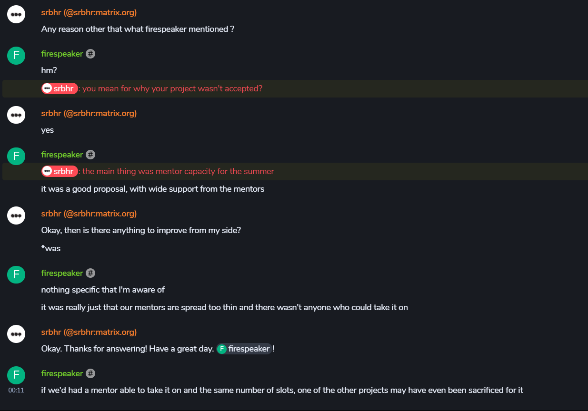
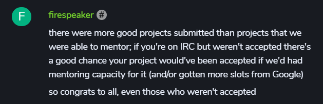
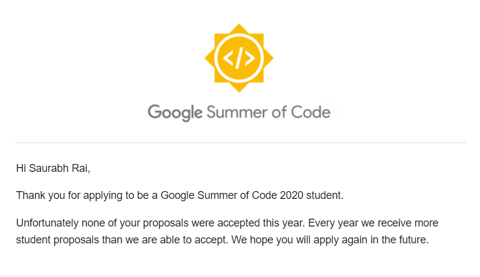

# GSOC 2020 Proposal

**(Proposal Rejected)**

Link: https://wiki.apertium.org/wiki/User:Srbhr/GSOC_2020_Proposal:_Automatic_PostEditing

Detailed Proposal can be found at the above link with reviews from the mentor.	

Reason for rejection is also available in the screen shots.

## Organization: Apertium Machine Translation

Wiki: https://wiki.apertium.org/wiki/Main_Page

Website: https://www.apertium.org

GSOC Page: https://summerofcode.withgoogle.com/organizations/6025268524744704/

## Project Description:

Can be found at this link: https://wiki.apertium.org/wiki/Ideas_for_Google_Summer_of_Code#Improving_language_pairs_mining_Mediawiki_Content_Translation_postedits

## Selected Projects-Students (GSOC 2020)

At this link: https://summerofcode.withgoogle.com/organizations/6025268524744704/#projects

## Reason for Rejection

Note: I'm srbhr, firespeaker is one of the mentors.

## Rejection Mail by Google

